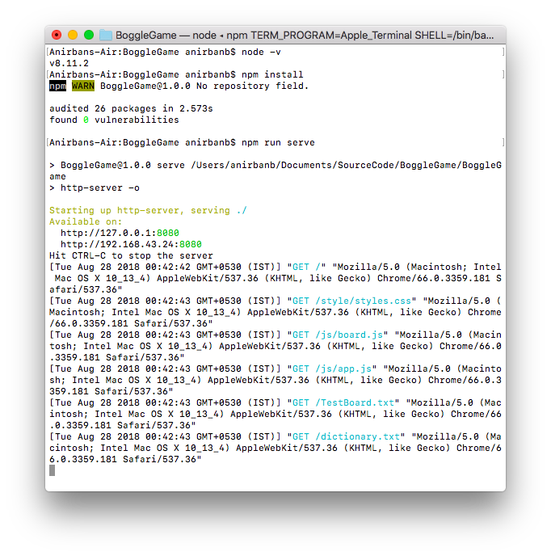
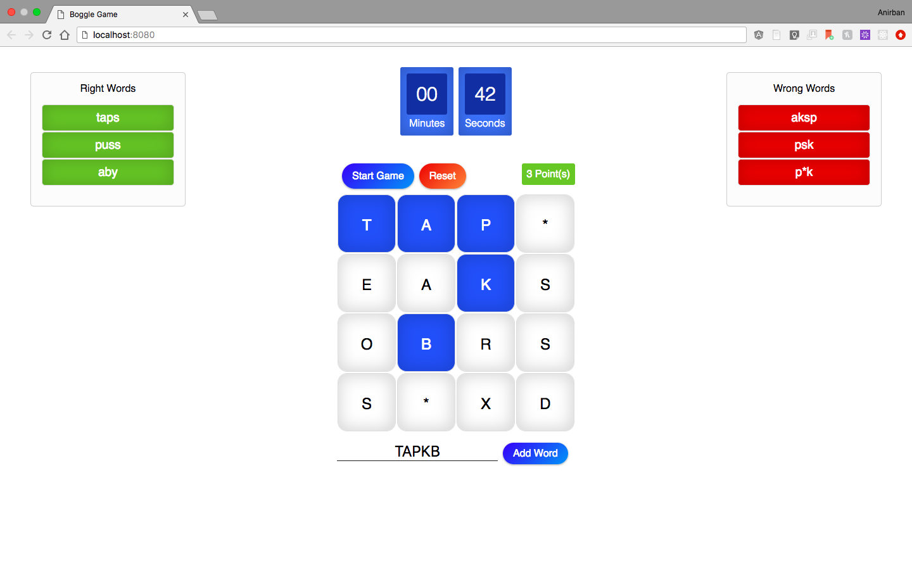

# Boggle Game

A simple Boggle game where users can enter a word or select the 8 adjecent letters of the board to consturct a word. The words are then validated againt the board and dictionary.


## Assumptions and Development

* Only tested in Chrome and Mozilla (Recent Versions).
* Not tested in ie.
* No third party JS library/ Framework has been used (not even Jquey). The Application is written purely in Javascript, HTML and CSS.
* Few configurations like board size, dictionary file path, board configuration file path and the game time can be configured by changing the values of BOGGLE_CONFIG object fields in app.js. Later it can be exposed to user in order to make the game configurable.
* Now you can select a word in board as well as type a word in the textbox.
* Adding the word by pressing RETURN / ENTER key is also introduced for quick addition and improved usability.
* Only alphabet and asterisk (*) are allowed to be entered in textbox.
* Color Condition (Hover over each resulting word to see the meaning of the color) ~
    - If a word is present in board and in dictionary then it will be in 'Right Words' list - having color GREEN
    - If a word is present in board but not in dictionary then it will be in 'Wrong Words' list - having color AMBER 
    - If a word is not present in board the it will be in 'Wrong Words' list - having color RED 

## Prerequisites & Setup

* You need to have [Node](https://nodejs.org) installed in your system.
* A server is required to run the application otherwise the application will not be able to read the static files ( dictionary.txt and TestBoard.txt ). So I have included a command line server - [http-server](https://www.npmjs.com/package/http-server) as a dependency in package.json (ideally it should be devdepedency), which is available as npm package. You can install it globally as well.

## Run

* Open command line (Windows) or terminal (Mac) Navigate to the root directory of the project.
* Run the following

```command line
npm install
```
```command line
npm run serve
```
* This will open a new browser window. If it does not you can hit the url http://127.0.0.1:8080/ or http://localhost:8080/
* Hit ctrl+c to stop the server

### Development checks

```command line
npm run lint
npm run build
```

These commands validate the JavaScript modules and generate a standalone build in the dist folder for testing or deployment.

Example Run



## Swipe / Draw Selection

You can now select words by swiping or drawing a line across adjacent tiles with left-click or touch.
- Start a game by clicking **Start Game**.
- Click (or touch) a tile and drag across adjacent tiles — letters will highlight as you move.
- Release to automatically submit the selected word if the toggle is enabled.

Use the new **Auto submit on release** checkbox to turn auto-submission on or off. Manual word entry and clicking tiles still work as before.

## Areas of improvement

* Error Handling
* Unit tests
* Converting to ES6
* Minification and Bundling

## Project Structure

```
|_js
| |_app.js
| |_assets.js
| |_board.js
| |_game.js
| |_queue.js
|_style
| |_styles.css
|_index.html
|_dictionary.txt
|_TestBoard.txt
|_eslint.config.js
|_package.json
```


## Development

The game is still intentionally lightweight, but it now uses modular JavaScript for asset loading and shared game logic while keeping the browser-based experience simple. The current workflow supports linting and standalone packaging without adding a framework.

## Thank You